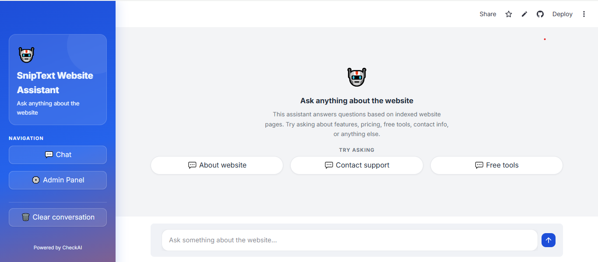
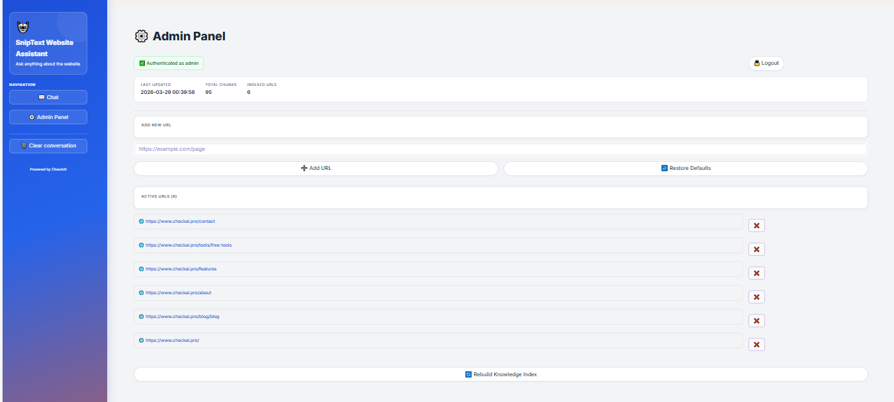
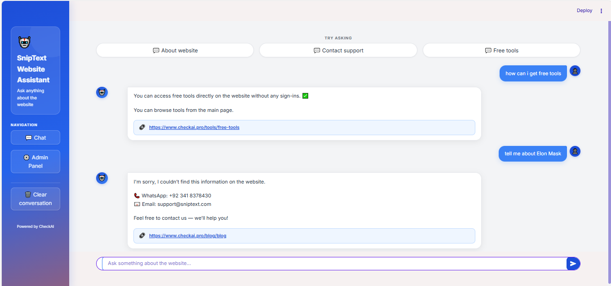

# SnipText Website Assistant

An AI-powered website chatbot that answers user questions from indexed website content using a Retrieval-Augmented Generation (RAG) workflow.

This project was built as a portfolio-ready AI assistant for business websites, combining smart question answering, related link suggestions, fallback contact support, and a simple admin panel for managing the knowledge base.
---
## Live Demo

You can explore the deployed project here:

🔗 [View Live Demo](https://sniptext-web-agent.streamlit.app/)

---

## Overview

**SnipText Website Assistant** is a website-based AI chatbot designed to answer questions strictly from a website’s own content.

Instead of giving generic AI responses, the assistant works from indexed website pages and returns answers based only on the available knowledge base. This makes the chatbot more reliable for support, website navigation, feature discovery, and contact guidance.

The project also includes a lightweight admin panel that allows management of indexed URLs and rebuilding of the knowledge base when website content changes.

---

## Project Highlights

- AI chatbot grounded in website-specific data
- Suggestion-based landing page for better user guidance
- Relevant answers with related website links
- Fallback handling for irrelevant or unsupported questions
- Contact guidance when the answer is not available
- Admin panel to add, remove, and rebuild indexed website data
- Clean and modern interface suitable for portfolio presentation

---

## Preview

### 1) Home Page

The home page is designed to provide a clean and user-friendly starting point for visitors.

#### What this screen shows

- **Branded sidebar**
  - Displays the project identity as **SnipText Website Assistant**
  - Gives the interface a professional SaaS-style layout
  - Keeps navigation always visible

- **Chat section**
  - Main chatbot area where users interact with the assistant
  - Focused on asking questions about the website and its services

- **Suggestion questions**
  - Ready-made prompts like:
    - About website
    - Contact support
    - Free tools
  - These help users start quickly without thinking about what to ask first

- **Admin Panel navigation**
  - A dedicated button in the sidebar gives access to the admin section
  - This separates user chat from website management

- **Clear conversation**
  - Lets the user reset chat history
  - Useful for starting a fresh session or testing new queries

- **Simple input area**
  - Clean message box for asking website-related questions
  - Designed to keep the chat experience easy and intuitive

This landing screen shows that the chatbot is not just a raw AI demo, but a structured assistant with guided interaction and clear navigation.

---

### 2) Admin Panel

The admin panel is built for managing the chatbot’s website knowledge base.

#### What this screen shows

- **Authenticated admin access**
  - Indicates that the panel is restricted for administrative use

- **Last updated timestamp**
  - Shows when the knowledge base was last updated
  - Useful for tracking when website content was indexed

- **Total chunks**
  - Displays how many content chunks were created for retrieval
  - This gives visibility into how much text data has been processed

- **Indexed URLs count**
  - Shows the number of website pages currently included in the chatbot knowledge base

- **Add new URL**
  - Admin can enter a website page URL to include more content in the assistant’s knowledge base

- **Restore defaults**
  - Quickly resets the URL list to the default indexed website pages

- **Active URLs list**
  - Shows all website pages currently used by the chatbot
  - Makes the indexed content transparent and manageable

- **Remove URL option**
  - Each URL can be removed individually
  - Useful for cleaning outdated or unwanted pages from the knowledge base

- **Rebuild Knowledge Index button**
  - Recreates the knowledge base after changes
  - Ensures the chatbot uses the latest indexed website data

This admin view demonstrates that the project is not only a chatbot, but also includes a management workflow for maintaining the AI knowledge system.

---

### 3) Q&A Demo

This screenshot demonstrates the chatbot’s real behavior during user interaction.

#### What this screen shows

##### Relevant question handling
When a user asks a question related to the indexed website content, the assistant:

- returns a direct answer based on the website data
- keeps the response concise and useful
- provides a **related website link** when it is relevant to the question

Example shown in the screenshot:
- User asks about **free tools**
- The chatbot responds with information from the indexed website
- A related link is displayed so the user can continue directly on the correct page

##### Irrelevant question handling
When a user asks something unrelated to the website, the assistant does **not invent an answer**.

Instead, it:

- avoids hallucinated or random responses
- states that the information was not found on the website
- provides official contact details so the user can get support directly

Example shown in the screenshot:
- User asks about an unrelated topic
- The chatbot does not try to answer outside the website knowledge base
- It returns a fallback support response with contact information

This behavior is important because the assistant is designed to answer from its **own website knowledge base only**, rather than behaving like a general-purpose chatbot.

---

## Core Features

### Website-Specific AI Question Answering
The chatbot answers questions using indexed website pages instead of relying on generic AI output.

### Guided User Experience
Suggestion prompts help visitors quickly ask useful questions such as support, features, and tools.

### Related Link Support
When relevant, the chatbot provides a matching website link to help users continue their journey on the correct page.

### Irrelevant Question Fallback
If the user asks something outside the indexed website content, the assistant avoids guessing and instead offers contact guidance.

### Admin Knowledge Management
The admin panel allows website URLs to be added, removed, reviewed, and re-indexed.

### Knowledge Base Rebuild
Content can be refreshed whenever website pages are updated.

---

## How the System Works

This project follows a practical website-RAG workflow:

1. Website URLs are added to the system
2. Website content is extracted and cleaned
3. Text is split into smaller chunks
4. Content is indexed into a searchable knowledge base
5. User questions are matched against relevant content
6. The assistant generates a response only from retrieved website data
7. If no reliable answer is found, the assistant returns a fallback support response

---

## Admin Capabilities

The admin panel is designed for lightweight knowledge base control.

### Supported actions
- Add new website URLs
- Remove unwanted URLs
- View active indexed links
- Check total indexed URL count
- Check total text chunks
- Rebuild the knowledge base after updates

This makes the project useful not only as a chatbot demo, but as a manageable AI content system.

---

## Chatbot Response Logic

The chatbot is built with controlled response behavior.

### When the question is relevant
- Retrieves website-specific content
- Generates a grounded answer
- Shows a related link when available

### When the question is irrelevant
- Does not guess
- Does not answer outside the indexed content
- Provides official contact guidance instead

This is a strong feature for business and support-focused AI tools, where accuracy and relevance matter more than general conversation.

---

## Tech Stack

- **Python**
- **Streamlit**
- **LangChain**
- **Google Gemini API**
- **Website content indexing**
- **RAG-based question answering**
- **Custom admin panel logic**

